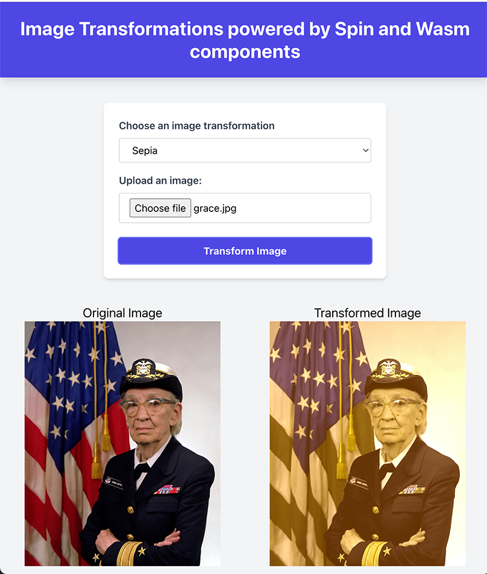
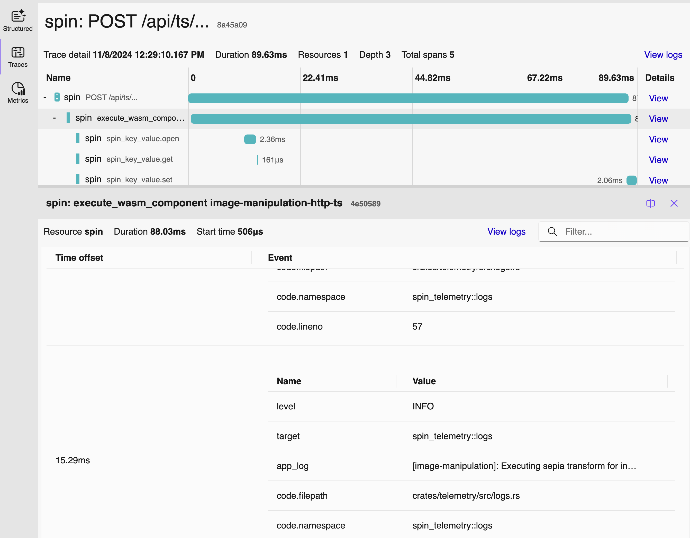

title = "Announcing Spin v3.0"
date = "2024-11-11T15:00:00Z"
template = "blog_post"
description = "The latest major release of Spin is here - with new features like Component Dependencies, Selective Deployments, Otel Integration, and Spin Factors."
tags = []

[extra]
type = "post"
author = "Michelle Dhanani"

---

The Spin community is proud to introduce [Spin 3.0](https://github.com/fermyon/spin/releases/tag/v3.0.0) — the latest major release of [Spin](https://developer.fermyon.com/spin), the open source developer tool for building, distributing, and running serverless WebAssembly (or Wasm) applications *everywhere*.

Since [the initial release of Spin back in 2022](https://www.fermyon.com/blog/introducing-spin), we have seen a growing community of passionate developers excited about the benefits they get from using Wasm: tiny, portable binaries, with [incredibly low startup latency](https://fermyon.github.io/spin-benchmarks/criterion/reports/spin-executor__noop/concurrency-1/index.html) and massive throughput; and we have seen developers use Spin to build and run apps in some of the most diverse places: from Kubernetes and conventional cloud platforms, to cars, factory floors, or even experimenting with running Spin apps in space.

## Spin 3.0 Highlights

We, the folks working on Spin, love Wasm for how lightweight it is, the quick cold start times and the superior safety guarantees. These properties make Wasm exciting for server side use cases, scenarios where containers are too slow or too big, situations where sandboxing is essential and for serverless use cases where you only want to use compute you actually need and portability is key. But Wasm is the gift that keeps on giving because we are just now scratching the surface of what Wasm can do for developers.

### Why We're More Excited About Wasm Than Ever

If you aren't familiar, WebAssembly provides a common bytecode format and compile target across programming languages. The WebAssembly Component Model takes that a step further and standardizes interfaces for components using WebAssembly Interface Types (WIT). WIT enables components to interoperate regardless of what language the components were originally written in and that’s where things get even more exciting. When you compile to a WebAssembly component, you can then use that component as a library or a dependency in another program written in an _entirely different language_. Now, there’s a lot that goes into being able to do this behind the scenes, and it’s not an entirely simple task. 

### Component Dependencies - Polyglot Programming Made Easy

Spin 3.0 introduces a workflow for this type of development in the hopes of making it seamless to do things like write a library for some compute intensive task in Rust and use that as a dependency in a JavaScript application. Or perhaps you’re not a Rust developer and don’t feel like learning it overnight? No problem. Fetch a component someone else already built from an OCI registry. Component dependencies can be stored, discovered, and fetched from OCI registries giving you the npm/NuGet/[crates.io](https://crates.io) style experience but for Wasm. Now, I think this particular feature is wild and could go on about it for at least a thesis, but there are even more Spin 3.0 topics to discuss so feel free to dig deeper in the component dependencies documentation [here](https://developer.fermyon.com/spin/v3/writing-apps#using-component-dependencies) and in the demo later on.

### Selective Deployments - Build As One, Deploy Selectively

You can now run a subset of components in a Spin application either locally with Spin CLI or [via SpinKube](https://www.spinkube.dev/docs/topics/selective-deployments). Spin 3.0 includes a new experimental flag: `spin up --component-id` that allows you to specify which components from your Spin application to run. In SpinKube, the containerd-shim-spin and spin-operator projects both support selective deployment of components and there is a new `components` section in the SpinApp Custom Resource Definition (CRD) spec that enables selective deployment of components from a Spin application. This unlocks new scenarios for platform engineers who want to selectively run components on nodes that meets certain requirements. It also provides a streamlined workflow for developers who choose to develop a single Spin application containing multiple components while still giving platform engineers flexibility on how to split up and run components in a way that makes sense at deploy time.

### Deeper Integration With WASI Standards

We’re big fans of standards in the Spin project. We both contribute to WASI APIs as we learn more about the needs of the community and also work to integrate them into the Spin project so folks can benefit from the collaboration and knowledge in the upstream WebAssembly community. With that said, we’re proud to announce that both the [WASI Key-Value](https://github.com/WebAssembly/wasi-keyvalue) and [WASI Config](https://github.com/WebAssembly/wasi-config) APIs are now officially supported in Spin. This marks an important next step in the journey to bringing [WASI cloud core](https://github.com/WebAssembly/wasi-cloud-core), a WASI proposal for standardizing a set of APIs applications can use to interact with a common set of cloud services, into Spin.

### OpenTelemetry (OTel) Integration - Observability With Batteries Included

Observability is essential for today’s application development and runtime environments, and we’ve been experimenting with how to ensure Spin applications can integrate seamlessly into existing observability stacks since Spin 2.4. Spin 3.0 now officially supports [OpenTelemetry (OTel) observability in Spin applications](https://developer.fermyon.com/spin/v2/observing-apps#observing-applications). This unlocks integrating Spin application observability with all of the great tools you already use today like Grafana, Jaegar, Prometheus and more. Spin applications have the ability to export metrics and provide distributed tracing out of the box, not to mention the [`spin otel` plugin](https://developer.fermyon.com/spin/v2/observing-apps#using-the-otel-plugin) makes setting up an observability stack even easier. We’re taking what we’ve learned and contributed upstream to the [WASI observe](https://github.com/WebAssembly/wasi-observe) specification and are working with the community to continue to tackle improvements in this area.

### Spin Factors - A Major Runtime Refactor

Last but not least for this post, we’ve done a HUGE refactor of the Spin internals with a feature called Spin Factors where a “factor” encapsulates a host functionality feature. Before Factors, host functionality was encapsulated in what we called “host components” but the more we added to Spin, the "soup-ier" things got. Another factor (get it?) in the creation of Spin Factors was the increase in the number of projects that are embedding Spin. These embeddings have slightly different environments and needs so we outgrew this concept of a “host component” and built an entirely new abstraction called Spin Factors based on these learnings. In turn, this allows the Spin runtime to be more modular. Everyone is a snowflake and we’re here for that. It’s also a bit easier now to extend the Spin runtime for your needs albeit it does require forking the project, but it’s possible and a big step in the right direction.

## Demos - Spin 3.0 In Action

Here is an example of what you can do with the new component dependencies feature in Spin 3.0. This is all built on top of the standards work happening across the ecosystem, with the streamlined developer experience we are building into Spin.

The workload scenario is simple. We are building an image transformation application with 3 major components:

- a front-end component where users can upload images and select their transformation
- an HTTP API component that receives images uploaded by users and the desired transformation
- an image manipulation component that performs the actual transformation

The common solution today is to use the same programming language for both your HTTP API component and the image manipulation component. If that is not possible or performant enough, then you might split the image manipulation component into its own microservice.

Using the power of Spin 3.0, we are going to use the new component dependency feature to build the image manipulation component in Rust, and consume that as a dependency from a JavaScript/TypeScript component that will act as our HTTP API. This shows the power of component dependencies feature as it allows us to use the right tool for the job.

Let’s start with writing [the interface for our image manipulation component](https://github.com/radu-matei/spin-deps-image-manipulation/blob/main/lib/wit/world.wit). We'll define our image manipulation package (using [the WIT format](https://github.com/WebAssembly/component-model/blob/main/design/mvp/WIT.md)) which contains one interface with two image transformations (grayscale and sepia):

```
package component:image-manipulation-lib;
...
/// Image manipulation interface.
interface image-manipulation {
    /// Error returned by image manipulation components.
    variant image-error {
        image-error(string),
        io-error(string),
        unknown(string),
    }
    /// Type representing an image.
    type image = list<u8>;
    /// Apply the grayscale transformation to the input image.
    grayscale: func(img: image, quality: u8) -> result<image, image-error>;
    /// Apply the sepia transformation to the input image.
    sepia: func(img: image, quality: u8) -> result<image, image-error>;
}
```

To implement this component in Rust, we will use a cargo component and a popular Rust image transformation library (photon-rs). Here is what the skeleton of the component implementation looks like:

```rust
impl Guest for Component {
    fn grayscale(img: Image, quality: u8) -> Result<Image, ImageError> {
        // perform the grayscale transformation using a performant Rust lib
    }

    fn sepia(img: Image, quality: u8) -> Result<Image, ImageError> {
        // perform the sepia transformation using a performant Rust lib
    }
}
```

We can build this into a Wasm component using cargo component. Now we’re now ready to publish this component to an OCI compliant registry using the latest work of the ecosystem around distributing Wasm components, [wkg](https://github.com/bytecodealliance/wasm-pkg-tools), or the new experimental plugin we are building for Spin that uses it, [`spin deps`](https://github.com/fermyon/spin-deps-plugin):

```console
$ cargo component build --release
  Generating bindings for image-manipulation-lib (src/bindings.rs)
   Compiling image-manipulation-lib v0.1.0
    Finished `release` profile [optimized] target(s) in 5.20s
    Creating component target/wasm32-wasip1/release/image_manipulation_lib.wasm

$ spin deps publish target/wasm32-wasip1/release/image_manipulation_lib.wasm \
    --registry fermyon.com \
    --package fermyon-experimental:image-manipulation-lib@6.0.0
	
    Published fermyon-experimental:image-manipulation-lib@6.0.0
```

We now have [a Wasm component that is published in a registry](https://github.com/orgs/fermyon/packages/container/wasm-pkg%2Ffermyon-experimental%2Fimage-manipulation-lib/302562897?tag=6.0.0) that we can now consume from a Wasm component written in an entirely different language!

We can continue building our image manipulation service by creating the HTTP API component in TypeScript which takes a dependency on the Rust component we just built:

```console
# create a new Spin application based on the TypeScript template
$ spin new -t http-ts image-manipulation-http-api

# add a dependency to the image manipulation component we pushed to the registry
$ spin deps add --registry fermyon.com \
		fermyon-experimental:image-manipulation-lib@6.0.0
```

The `spin deps` plugin walks us through selecting the right interface from the package we published and adds it as a dependency to our TypeScript component in the application manifest (spin.toml):

```toml
[component.image-manipulation-http-api.dependencies]
"component:image-manipulation-lib/image-manipulation" = { 
    version = "^6.0.0", 
    registry = "fermyon.com", 
    package = "fermyon-experimental:image-manipulation-lib" 
}
```

>Note: the spin deps plugin is experimental and will most likely change in the near future. If you are interested in dependency management and distributing Wasm components using registries, join our [Discord server](https://discord.gg/AAFNfS7NGf)!

We can now consume the dependency from our TypeScript component:

```javascript
import { grayscale, sepia } from "component:image-manipulation-lib/image-manipulation"

// ...

switch (transform) {
    case "grayscale":
        transformed = grayscale(new Uint8Array(body), quality);
        break;
    case "sepia":
        transformed = sepia(new Uint8Array(body), quality);
        break;
    default:
        throw new Error("Unknown image transform");
}
```

>Check the [demo repository](https://github.com/radu-matei/spin-deps-image-manipulation) for the complete application and build setup. It also contains an example of consuming the same image manipulation component from a Rust HTTP API.

You can use all the built-in Spin features for [key/value data](https://spinframework.dev/v3/kv-store-api-guide), [configuration](https://spinframework.dev/v3/variables), or [relational databases](https://spinframework.dev/v3/sqlite-api-guide). If you need inspiration, the HTTP API component in this example uses the key/value store to cache transformed images.

At this point, we can build the entire application using `spin build` and run it locally using `spin up`, which takes care of all necessary steps for our composition.



You can get full observability support out of the box in your local setup using the [OpenTelemetry plugin](https://spinframework.dev/v3/observing-apps#using-the-otel-plugin) for Spin. With the new release of the [`spin otel` plugin](https://github.com/fermyon/otel-plugin), you can choose between the default stack based on Prometheus, Grafana, and Loki, or a new stack based on [the .NET Aspire dashboard](https://github.com/dotnet/aspire/tree/main/src/Aspire.Dashboard). For example, here is a screenshot of the Aspire observability dashboard for the image manipulation application:



## State of the Ecosystem

We’ve seen a number of CLI plugins and trigger plugins come about. Thank you to those who have contributed. There are also new releases of the SpinKube project. The containerd-shim-spin, spin-operator and spin kube CLI plugin all boast new features including [selective deployment](https://www.spinkube.dev/docs/topics/selective-deployments).

## Thank you!

Thank you to everyone who has [contributed to Spin 3](https://github.com/fermyon/spin/graphs/contributors), filed issues, opened pull requests, participated in Discord and especially to our new contributors. We are excited to see the community grow and continue to iterate on building an even better experience for building and running serverless WebAssembly applications. Please join us at the weekly public Spin project meetings, in the discord channels and on the repository.

And a special thank you to everyone who has been contributing and continues contribute to the WebAssembly ecosystem particularly to the maintainers of the Bytecode Alliance projects, [the Wasmtime](https://github.com/bytecodealliance/wasmtime/) project and the developers working on [WASI](https://github.com/webassembly/wasi) and [the WebAssembly component model](https://github.com/webassembly/component-model). Their work is instrumental in supporting Spin.

## Stay In Touch

Please join us for weekly [project meetings](https://github.com/spinframework/spin#getting-involved-and-contributing), chat in the [Spin CNCF Slack channel](https://cloud-native.slack.com/archives/C089NJ9G1V0) and follow on X (formerly Twitter) [@spinframework](https://twitter.com/spinframework)!

To get started with Spin and explore the latest features, follow the [Spin quickstart](https://spinframework.dev/v3/quickstart) which provides step-by-step instructions for installing Spin, creating your first application, and running it locally. Also head over to the [Spin Hub](https://spinframework.dev/hub) for inspiration on what you can build!
